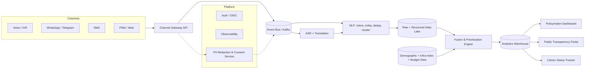

# Architecture — Setu

## 1. Context & Constraints

- **Functional:** ingest voice/text/messaging reports in 10+ languages → cluster → score against demographic + infra + budget data → surface to policymakers.
- **Non-functional:** must run per-nation with **sovereign data residency**, handle bursty low-bandwidth traffic (2G/IVR), and stay auditable/open-source (DPG requirement).
- **Constraints:** hackathon timeline for MVP; long-term must be cloud-agnostic (no vendor lock, per PRD §6).

## 2. High-Level Architecture



## 3. Component Breakdown

| Component | Tech (reference) | Responsibility |
|---|---|---|
| Channel Gateway | Twilio/Asterisk (voice), WhatsApp Business API, SMS aggregator, PWA | Normalize inbound reports into a common event schema |
| PII Redaction/Consent | Custom service, in front of the bus | Strip/tokenize identifiers before anything is persisted; store consent flag |
| ASR + Translation | Whisper/regional ASR models, NLLB-200-class MT | Speech→text, translate to canonical pivot language for clustering |
| NLP Pipeline | spaCy/transformers, BERTopic-class clustering | Intent classification, entity/geo extraction, dedup, clustering into demand signals |
| Data Lake | Object storage (S3/MinIO-compatible), Postgres+PostGIS | Raw events + structured, geotagged demand signals |
| Fusion/Prioritization Engine | Rules + explainable ML (gradient boosted scoring w/ SHAP-style factor breakdown) | Combine demand + demographic + infra-deficit + budget → ranked, explained recommendations |
| Analytics Warehouse | ClickHouse/BigQuery-class OLAP | Aggregation for dashboards & public portal |
| Policymaker Dashboard | React + map/GIS layer | Hotspots, ranked queue, drill-down evidence, scenario simulation |
| Public Portal | Static/SSR site over warehouse read-replica | Anonymized transparency view |
| Platform services | K8s, OIDC/Keycloak, Prometheus/Grafana/OpenTelemetry | AuthN/Z, observability, multi-tenant isolation |

## 4. Data Model (core entities)

```
CitizenReport(id, channel, lang, raw_ref, consent_flag, submitted_at, geo, region_id)
DemandSignal(id, category, cluster_of[CitizenReport], urgency_score, sentiment, geo_cluster)
InfrastructureIndex(region_id, sector, deficit_score, last_updated)
DemographicUnit(region_id, population, density, vulnerability_index)
BudgetLine(nation_id, sector, fiscal_year, amount_allocated, amount_available)
PriorityScore(demand_signal_id, score, factor_breakdown[json], generated_at, model_version)
Project(id, priority_score_id, status, funded_amount, impact_indicators[json])
```

`region_id` and `nation_id` are the tenancy keys — every table partitions by nation for data residency.

## 5. Multi-Nation Deployment Model

Each BRICS nation runs its **own sovereign deployment** (own cluster, own data plane, own encryption keys) built from the same open-source core — a **federated**, not centralized, architecture:

```mermaid
flowchart TB
    CORE[Open-source Setu Core\n(shared repo, DPG-licensed)]
    CORE --> N1[Nation A deployment\nown k8s cluster, own data]
    CORE --> N2[Nation B deployment]
    CORE --> N3[Nation C deployment]
    N1 -. optional, opt-in .-> AGG[Cross-nation aggregate\nmethodology/benchmark exchange only\u2014no raw citizen data]
    N2 -. optional, opt-in .-> AGG
    N3 -. optional, opt-in .-> AGG
```

Only anonymized, aggregate methodology/benchmarks may cross borders, and only opt-in (see `Rules.md` §2).

## 6. Key ADRs

### ADR-001: Event Bus — Kafka vs. Cloud Pub/Sub
**Status:** Accepted
**Context:** Need to ingest bursty voice/SMS traffic and fan out to ASR/NLP without vendor lock-in (DPG requirement).
| Dimension | Kafka (self-hosted/Strimzi) | Managed cloud pub/sub |
|---|---|---|
| Complexity | Higher ops burden | Lower |
| Cost | Predictable at scale | Pay-per-message, spikes get costly |
| Portability | Runs identically in any nation's cluster | Locks to one cloud |
| Team familiarity | Moderate | High if already on that cloud |
**Decision:** Kafka (via Strimzi on k8s) — portability is non-negotiable for a DPG deployed across sovereign clusters.
**Consequences:** Need in-house Kafka ops runbook; gain full cloud independence.

### ADR-002: On-device/edge ASR vs. centralized cloud ASR
**Status:** Accepted
**Context:** Rural/low-connectivity regions need voice intake even on 2G.
**Decision:** Hybrid — lightweight on-device wake+capture, batched upload, server-side ASR (not real-time edge inference) for MVP; revisit edge ASR in Phase 3 if latency complaints arise.
**Consequences:** Slight delay (minutes, not real-time) on voice reports in poor connectivity; big reduction in device/complexity cost.

### ADR-003: Federated per-nation data plane vs. single global data plane
**Status:** Accepted
**Context:** BRICS nations have distinct data-sovereignty laws; a DPG must be adoptable without a cross-border data treaty.
**Decision:** Federated — one deployment per nation, shared open-source core, no raw data leaves a nation's cluster by default.
**Consequences:** No single "global dashboard" out of the box (by design); cross-nation comparison limited to opt-in aggregate stats.

## 7. Testing Strategy

```
        /  E2E  \        citizen-report → dashboard, few, slow, high confidence
       /Integration\      channel gateway ↔ bus ↔ NLP ↔ warehouse, medium speed
      /  Unit Tests  \    scoring math, dedup logic, translation routing — many, fast
```

| Layer | Focus | Coverage target |
|---|---|---|
| Unit | Prioritization scoring, dedup/clustering logic, PII redaction rules | ≥ 85% on scoring/redaction code |
| Integration | Channel Gateway ↔ Bus ↔ NLP ↔ Warehouse contracts | All critical paths covered |
| E2E | Full report→dashboard journey per channel (voice, WhatsApp, SMS, PWA) | 1 happy-path + 1 failure-path per channel |
| Model/Bias | ASR accuracy & scoring fairness per language/region cohort | Reviewed every model release, not just at launch |
| Load/Chaos | IVR/WhatsApp burst simulation, Kafka partition loss | Quarterly game-day |

Skip testing trivial CRUD/admin screens and framework glue code — focus effort on scoring math, redaction, and cross-service contracts, since those are the business-critical and security-critical paths.

## 8. Security & Observability
- mTLS between internal services; OIDC (Keycloak-class) for dashboard/portal auth.
- PII redaction happens **before** the event bus, never after (fail-closed if redaction service is down).
- OpenTelemetry traces across gateway→bus→NLP→warehouse; Prometheus/Grafana for SLOs (ingestion latency, ASR queue depth, scoring freshness).

## 9. What We'd Revisit as It Scales
- Move from batch ASR to streaming/edge ASR once voice volume justifies it.
- Introduce a feature store if the scoring model grows beyond hand-tuned features.
- Add a dedicated geospatial tile service if hotspot map rendering becomes a bottleneck.
